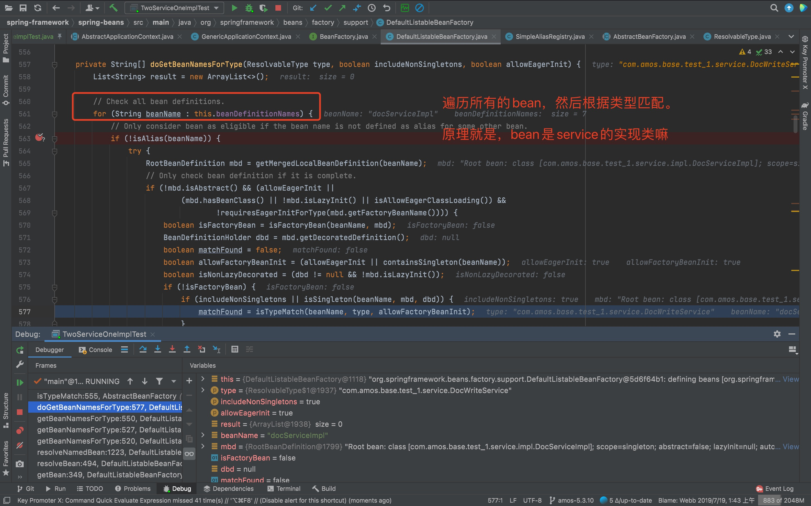
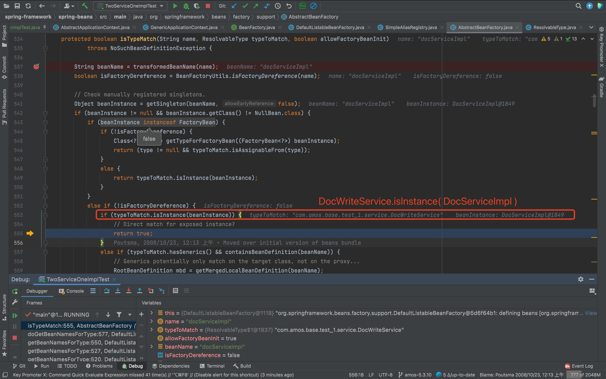
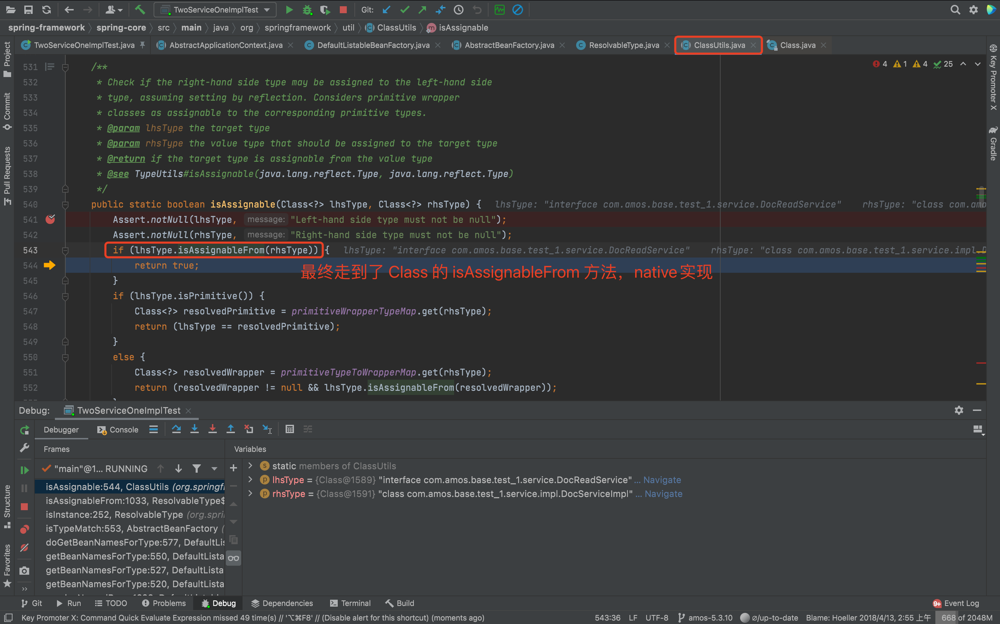

# 两个Service接口共用一个实现，Spring注入时正常吗

> 看了设计模式之美，里边提到一种写法，就实现一下

这种写法，项目中是有可能用到的，对于业务没那么复杂，并且有必要隔离接口的场景。

例如一些操作是面向客户端的，一些操作是面向管理后台的。还是有使用场景的。

```java
public interface DocReadService {

    String query();

}
```

```java
public interface DocWriteService {

    void save(String value);

}
```

```java
@Service
public class DocServiceImpl implements DocReadService, DocWriteService {

	private String value;

	@Override
	public String query() { return this.value; }

	@Override
	public void save(String value) { this.value = value; }
}
```

```java
/**
 * 这个是测试代码，既然分了接口，自然是不会放在一个 Controller
 */
@RestController
public class DocController {

    @Resource
    private DocReadService docReadService;
    @Resource
    private DocWriteService docWriteService;

    // ...
}
```

试想下，DocController 可以正常初始化吗？

答案：可以正常初始化

## 跟下源码






