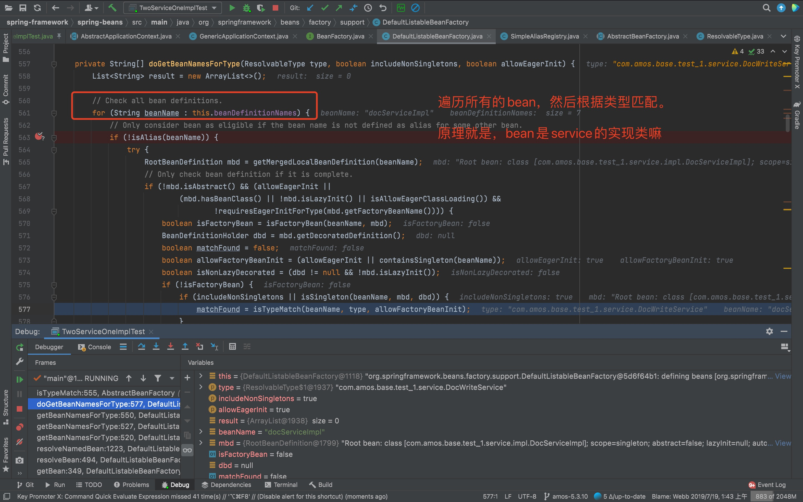
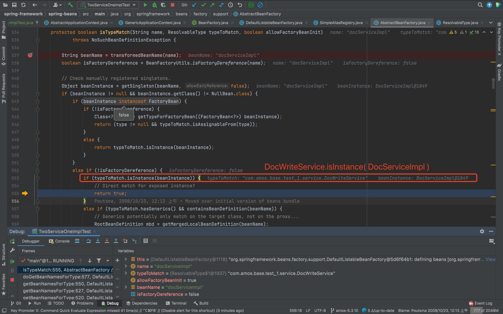
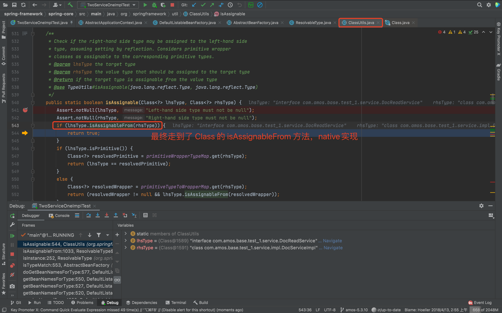

# 一个Bean实现两个接口，依赖注入会出现异常吗 ？

> 看了设计模式之美，里边提到一种写法，大致就是接口隔离，两个接口可以使用一个实现，测试下吧

这种写法，项目中是有可能用到的，适用于那种业务没那么复杂，接口有必要隔离的场景。例如一些操作是面向客户端的，一些操作是面向管理后台的。

```java
public interface DocReadService {

    String query();

}
```

```java
public interface DocWriteService {

    void save(String value);

}
```

```java
/**
 * 实现两个接口
 */
@Service
public class DocServiceImpl implements DocReadService, DocWriteService {

    private String value;

    @Override
    public String query() {
        return this.value;
    }

    @Override
    public void save(String value) {
        this.value = value;
    }
}
```

```java
/**
 * 这个是测试代码，既然分了接口，自然是不会放在一个 Controller
 */
@RestController
public class DocController {

    @Resource
    private DocReadService docReadService;
    @Resource
    private DocWriteService docWriteService;

    // ...
}
```

那么问题来了，**DocController 可以正常初始化吗？**

**答案：** 可以正常初始化

## 分析下初始化过程

### 1. DocServiceImpl 初始化

这个应该和正常的Bean初始化过程一样，根据@Service注解，初始化Bean

### 2. DocController 初始化

这个就涉及到依赖注入了，并且理论上注入到是同一个对象。注入的时候，应该是根据类型查找对应的Bean，那具体是怎么查找的呢？就看下边的源码吧

## 跟下getBean源码

> 完整的 getBean 过程就不说了，看几个主要的点。🙊🙊🙊

### doGetBeanNamesForType 根据type获取beanName

> 遍历所有初始化过了的beanNames，然后根据beanName和type执行后续匹配逻辑。



### isTypeMatch 真正的类型匹配

> getSingleton(beanName, ...)，拿到对应的beanInstance。再根据beanInstance和type执行匹配。



### 最后，就是type和beanInstance.getClass()之间的匹配了

> 执行到 org.springframework.util.ClassUtils.isAssignable() 方法，再到 java.lang.Class.isAssignableFrom()，KO


